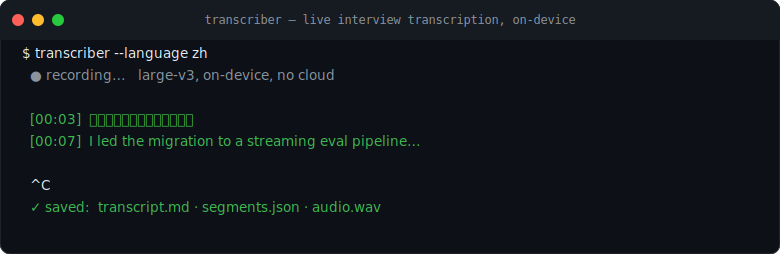

# Transcriber

[](https://github.com/yingchen-coding/transcriber/actions)
[](pyproject.toml)
[](LICENSE)



Record the room. Keep the raw audio. Get live notes now and a cleaner transcript after.

Transcriber is a local-first macOS recorder for meetings, interviews, lectures, calls on speaker,
debugging sessions, and voice notes. It starts only when you ask, writes durable 16 kHz WAV audio
first, streams a live transcript while recording, then re-transcribes longer windows after stop for
a cleaner final artifact.

Raw audio stays on your machine by default. Recording never starts automatically. Get consent from
everyone being recorded.

## Star This If

- You want a private room recorder for interviews, meetings, lectures, or voice notes.
- You need live notes immediately and a cleaner final transcript for review.
- You want evidence-grounded analysis prompts without sending data anywhere by default.

## What It Does

- Records a session to a durable 16 kHz WAV file.
- Opens a visible Terminal monitor with a recording heartbeat and live transcript.
- Uses MLX Whisper large-v3 on Apple Silicon Macs.
- Re-transcribes 30-second windows after stop for a cleaner final transcript.
- Preserves live and final TXT/JSONL artifacts plus per-chunk latency metrics.
- Generates an evidence-constrained analysis prompt without sending data anywhere by default.
- Builds timestamp-preserving translation packets for TXT, JSONL, SRT, and VTT transcripts.
- Builds local document packets from PDF, TXT, or Markdown files for actions, claims, and tasks.

## Install

```bash
python3 --version  # must be 3.10+
python3 -m pip install -e '.[dev]'
```

The first run downloads the MLX Whisper large-v3 model. Transcriber is intended for Apple Silicon
macOS. The macOS Command Line Tools Python may be 3.9 and is not supported; use Homebrew, Conda, or
another Python 3.10+ environment.

## Use

Chinese-dominant speech with embedded English terms:

```bash
transcriber start --name team-sync --language zh
```

English-dominant speech:

```bash
transcriber start --name lecture-notes --language en
```

Control and analyze:

```bash
transcriber doctor
transcriber status
transcriber stop
transcriber refine ~/Documents/transcripts/SESSION
transcriber analyze ~/Documents/transcripts/SESSION
transcriber translation-packet SESSION/transcript.txt --target-language zh-CN
transcriber document-packet paper.pdf
```

Run `transcriber doctor` before an important session. It checks Python version, macOS, MLX Whisper
availability, and whether an input device is visible.

`analyze` defaults to generating a local `analysis-prompt.txt` without invoking a model. Running
`analyze SESSION --engine claude` explicitly sends the prompt and transcript through the configured
Claude CLI; use it only when that data-handling path is acceptable.

Sessions are stored under `~/Documents/transcripts/`.

## Quick Start

```bash
transcriber doctor
transcriber start --name interview-practice --language zh
# speak for a short test
transcriber stop
transcriber analyze ~/Documents/transcripts/interview-practice*
```

For best accuracy, use an external microphone, keep speakers audible, and choose the dominant
language explicitly. Use `zh` for Chinese with embedded English terms; use `en` for English-heavy
sessions.

## Artifacts

- `audio.wav`: complete source recording
- `transcript-live.txt` / `.jsonl`: live pass
- `transcript.txt` / `.jsonl`: final pass
- `transcription-metrics.jsonl`: inference latency and filtering outcomes
- `metadata.json`: models, duration, language mode, and dropped-block count
- `analysis-prompt.txt`: timestamp-grounded analysis input
- `analysis.md`: optional generated analysis
- `translation-packets/`: optional timestamp-preserving translation prompts, segments, glossary,
  and bilingual fill-in templates
- `document-packets/`: optional extracted document text plus action, claim, and task prompts

## Translation Packets

Use `translation-packet` when you need to translate a transcript without losing timestamps:

```bash
transcriber translation-packet transcript.jsonl --target-language zh-CN
transcriber translation-packet subtitles.srt --target-language en
transcriber translation-packet captions.vtt --output-root ./translation-work
```

The command does not call a translation service. It creates a local packet with:

- `packet.json`: source name, target language, segments, glossary, and prompt
- `prompt.txt`: instructions for a translation model or human translator
- `segments.txt`: timestamped source segments
- `bilingual-template.md`: a fill-in review template

The packet stores the transcript file name, not your absolute local path.

## Document Packets

Use `document-packet` when a PDF or saved article should become implementation work instead of
another unread file:

```bash
transcriber document-packet report.pdf
transcriber document-packet notes.md --output-root ./document-work
```

For PDFs, install `pdftotext` first:

```bash
brew install poppler
```

The command runs locally and creates:

- `packet.json`: source file name, extracted segments, glossary, and prompts
- `extracted.txt`: page or section chunks with stable locations
- `action-prompt.txt`: prompt for implementation-ready action items
- `claim-prompt.txt`: prompt for evidence-gated claims
- `task-prompt.txt`: prompt for a local workboard queue

The packet stores the document file name, not your absolute local path.

## Boundaries

- Select the primary language explicitly. Use `zh` for Chinese with embedded English terms and `en`
  for English-dominant sessions. Short-chunk automatic language detection is not reliable enough.
- The current backend captures a microphone, not macOS system audio. Use speakers rather than
  headphones so remote participants are audible.
- Mac mini has no built-in microphone. Accuracy depends heavily on the connected input device,
  distance, room echo, and overlapping speakers.
- The live transcript prioritizes visibility; use the final transcript for review.

## Test

```bash
python3 -m unittest discover -s tests -v
python3 -m ruff check transcriber.py tests
```
